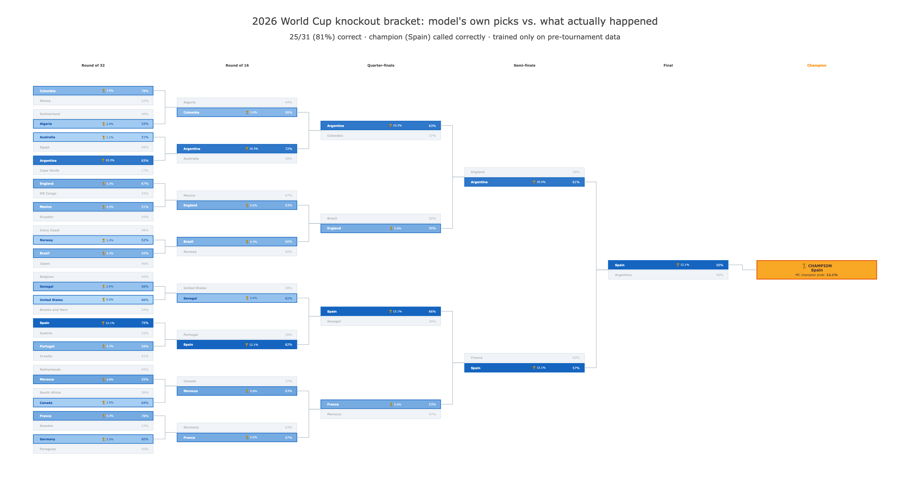

# World Cup Quant Dashboard

An Elo-based forecasting model for the 2026 FIFA World Cup, with a Monte Carlo tournament simulator, a six-tournament walk-forward backtest, a live Discord bot, and a Streamlit dashboard.

The tournament is over, so this repo reports how the model actually did rather than what it hoped to do.

> **Educational and analytical only. Places no trades and is not financial or betting advice.** Reads public market data.

---

## Results

Predictions were generated from pre-tournament data only, with no lookahead and no mid-tournament adjustment.

| | Result |
|---|---|
| **Knockout bracket** | **25 of 31 matches correct (81%)**, champion (Spain) called correctly |
| **Live match forecasts** | Brier **0.181** across 72 predictions logged in real time during the tournament |
| **Naive baseline** | Brier 0.222 (uniform 1/3 per outcome) |
| **Historical backtest** | Brier ~0.19 to 0.21 across six World Cups (2002 to 2022), walk-forward |

The live 2026 score (0.181) landing slightly better than the six-tournament historical range is the useful part: it is out-of-sample evidence the model is not just fit to history.



**What this project does not show:** whether the model beats the *market*. Live market-odds capture failed silently for the whole tournament, so every edge and ROI figure here is measured against a flat 1/3 baseline, not real prices. That is an honest null, and it is documented rather than papered over.

📄 **[Read the full write-up](WRITEUP.md)** for the methodology, the ideas that failed, the bugs found in a post-tournament audit, and the limitations.

---

## Quickstart

```bash
cd wcq
python -m venv venv && source venv/bin/activate   # Windows: venv\Scripts\activate
pip install -r requirements.txt
python src/data/historical.py        # download ~50k historical matches
python tests/test_smoke.py           # fast sanity checks
streamlit run app/streamlit_app.py   # launch the dashboard
```

---

## How it works

```
results.csv (50k matches)          Polymarket / Kalshi (live odds)
     ↓                                      ↓
historical.py (load/clean)           markets.py (fetch prices)
     ↓                                      ↓
elo.py (team ratings)              implied.py (de-vig → clean probs)
     ↓                                      ↓
match_model.py (win/draw/loss)             |
     ↓                                      |
tournament.py (MC bracket sim)             |
     ↓                                      |
svi_surface.py (survival curves)           |
     ↓_____________________________________|
                   edges.py (model vs market)
                         ↓
               streamlit_app.py (dashboard)
                         ↓
              src/bot/ (Discord notification layer)
```

**Model details**

- **Elo:** replayed over every international match from 1872 to present, 5% annual mean-reversion, 5-tier tournament K-weighting (World Cup finals K=60 down to friendlies K=20).
- **Draw model:** `P(draw | Δelo) = draw_base × exp(-|Δelo| / scale)`, fit by maximum likelihood on ~21k competitive matches rather than hardcoded.
- **Confederation offsets:** per-confederation Elo corrections fit by MLE on cross-confederation results, correcting a real bias where CONCACAF teams were overrated against UEFA and CONMEBOL opposition. See [WRITEUP.md](WRITEUP.md) sections 1 to 4.
- **Monte Carlo:** 20,000 simulations of the 48-team bracket for round-by-round survival probabilities.

**Methodology guarantees**

- Elo for any backtested tournament is trained strictly on matches before that tournament's start date.
- Fitted parameters (confederation offsets, goal-difference weight) come only from pre-cutoff data.
- Both guarantees are enforced by tests in [`wcq/tests/test_no_lookahead.py`](wcq/tests/test_no_lookahead.py), including a regression test for a lookahead bug found and fixed in a post-tournament audit.

---

## Dashboard

| Tab | Contents |
|-----|----------|
| Live markets | Polymarket + Kalshi prices, Kalshi round-survival pivot |
| Model forecast | Top-20 Elo ratings, Monte Carlo survival probabilities, group tables |
| Edge detection | Model vs market edges, with Kalshi round-label remapping |
| Survival surface | SVI-style survival curves per team across rounds |
| Backtest | Six historical World Cup backtests (2002 to 2022), 2026 forward simulation |
| Findings | Brier/hit-rate summary, key findings, real 2026 bracket vs actual results |

## Discord bot

Posts automated alerts to a private server. Deployed on GitHub Actions (scheduled jobs) plus Railway (always-on live poller). See [DEPLOY.md](wcq/DEPLOY.md).

| Notification | When |
|---|---|
| Daily digest | 07:00 UTC |
| Pre-match briefing | ~1 hour before kickoff |
| Post-match scorecard | 10 to 90 min after full time |
| Paper bet placed / P&L | Alongside pre/post-match |
| Live edge alert | During match, edge > 6% |
| Cross-platform spread | During match, Polymarket vs Kalshi > 4% |

---

## Repo layout

| Path | Job |
|------|-----|
| `wcq/config.py` | Shared paths, API endpoints, model knobs |
| `wcq/src/data/` | Historical results loader, market price fetchers |
| `wcq/src/models/` | Elo, match model, tournament MC, confederations, SVI surface |
| `wcq/src/markets/` | Implied probabilities, de-vig, edges, Kelly sizing |
| `wcq/src/backtest/engine.py` | Walk-forward backtest, Brier scoring, staking sim |
| `wcq/src/bot/` | Discord bot (storage, notify, poller, paper trader, results) |
| `wcq/jobs/` | Scheduled job scripts (digest, pre-match, post-match, backfill) |
| `wcq/app/streamlit_app.py` | Dashboard |
| `wcq/tests/` | Smoke tests and no-lookahead guarantees |
| `wcq/run_significance_test.py` | Bootstrap significance test for the model corrections |

---

## How the SVI framing transfers

Options SVI fits a smooth, low-parameter, no-arbitrage curve to sparse market quotes. This project reuses the *methodology*, not the equation:

| Options world | This project |
|---|---|
| Maturity axis | Tournament round depth (group → champion) |
| Implied-vol surface | P(team survives to that round) |
| Butterfly no-arb | Per-round survival probabilities form a valid distribution |
| Calendar no-arb | Survival monotone non-increasing in round depth |

The SVI hyperbola is tuned to volatility smiles, so the approach transfers (smooth, no-arb-constrained, market-calibrated) but the formula does not. See `wcq/src/models/svi_surface.py`.

---

## Data and legal notes

- Historical data: [martj42 international-results dataset](https://github.com/martj42/international_results) (public, no auth)
- Markets: Polymarket Gamma API and Kalshi public endpoints, read-only, no API key
- Polymarket restricts US access and Kalshi is CFTC-regulated. This project only reads public prices and simulates.

## License

[MIT](LICENSE)
